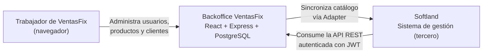
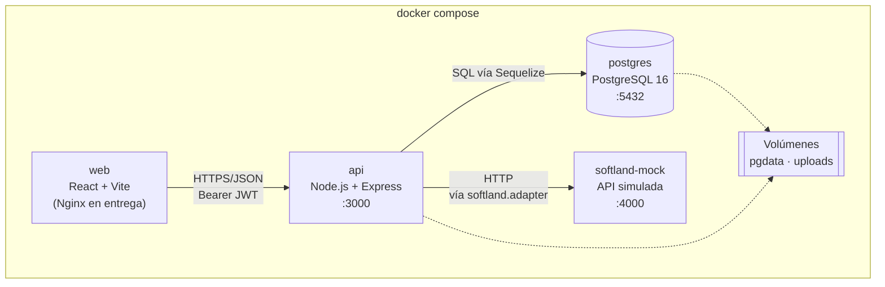
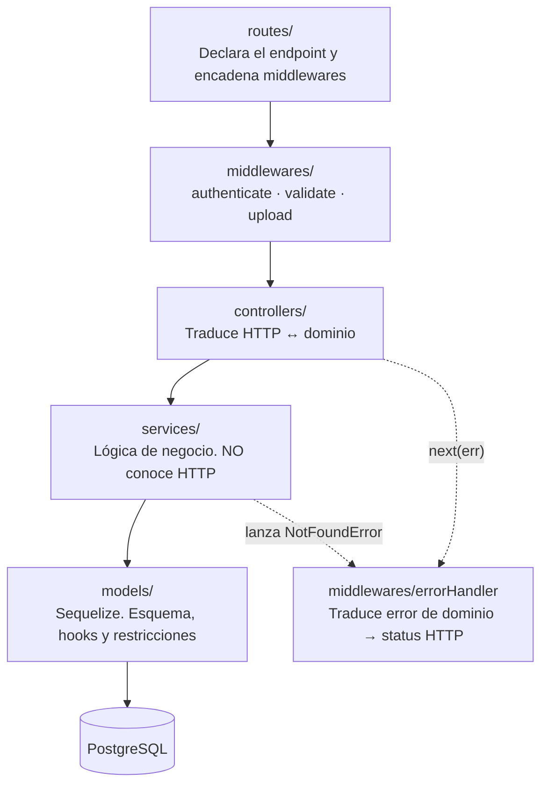

# Arquitectura del sistema

El sistema es una **SPA de React que consume una API REST de Express**, con PostgreSQL como almacenamiento y un servicio externo simulado de Softland. La API es la única puerta de entrada a los datos: el backoffice y Softland entran por la misma puerta, con el mismo esquema de autenticación y la misma lógica de negocio.

## Vista de contexto

Quién usa el sistema y con qué se conecta.



**Lo importante:** Softland no tiene un camino privilegiado. Consume exactamente los mismos endpoints que el backoffice, así que no existe lógica de negocio duplicada ni una "API secundaria" que se desactualice.

## Vista de contenedores

Qué se despliega y cómo se comunican las piezas.



| Contenedor | Responsabilidad | Puerto |
|---|---|---|
| `web` | Sirve la interfaz. En desarrollo, Vite con HMR; en entrega, build estático sobre Nginx | 5173 / 80 |
| `api` | Toda la lógica de negocio, validación, autenticación y acceso a datos | 3000 |
| `postgres` | Persistencia. Volumen `pgdata` para que los datos sobrevivan a `docker compose down` | 5432 |
| `softland-mock` | Simula la API del ERP. Proceso separado con su propia URL, así la integración cruza una frontera HTTP real | 4000 |

## Capas del backend

El flujo de una petición atraviesa cinco capas, cada una con una sola responsabilidad.



### La regla que sostiene todo

> **La capa de servicios no sabe que existe HTTP.**

Si `productService.findById()` ejecutara `res.status(404)`, la lógica de negocio quedaría casada con el transporte: ya no se podría invocar desde el adapter de Softland, desde una tarea programada ni desde un test sin levantar Express.

El servicio habla el idioma del dominio —"este producto no existe"— y lanza `NotFoundError`. Traducir eso a un número HTTP es responsabilidad exclusiva de la capa web.

El resultado son controllers de tres líneas:

```js
async function getById(req, res, next) {
  try {
    const product = await productService.findById(req.params.id);
    res.status(200).json(product);
  } catch (err) {
    next(err);
  }
}
```

El `404` no aparece por ningún lado porque no es asunto del controller. → [ADR-010](adr/ADR-010-errores-de-dominio.md)

## Recorrido de una petición

`POST /api/products` con imagen, paso a paso:

| # | Capa | Qué hace | Si falla |
|---|---|---|---|
| 1 | `routes/product.routes.js` | Encadena `authenticate → upload → validate → controller` | — |
| 2 | `authenticate.middleware` | Verifica la firma y vigencia del JWT | `401` |
| 3 | `upload.middleware` | Multer guarda la imagen en el volumen y deja la ruta en `req.file` | `413` / `415` |
| 4 | `validate.middleware` | Aplica el schema Zod del producto | `422` con detalle por campo |
| 5 | `product.controller` | Extrae el payload y delega en el servicio | — |
| 6 | `product.service` | Verifica SKU único, calcula reglas de negocio | `409` si el SKU existe |
| 7 | `product.model` | Hook `beforeSave` recalcula `sale_price`; Sequelize hace el `INSERT` | — |
| 8 | `product.controller` | Responde `201` con el recurso creado y cabecera `Location` | — |

## Estructura de carpetas

Cada archivo declara su rol en el nombre. Un evaluador que busca "los controladores" los encuentra en `controllers/`.

### Backend (`api/`)

```
api/
├── src/
│   ├── config/         database.config.js · env.config.js · swagger.config.js
│   ├── models/         user.model.js · product.model.js · client.model.js · index.js
│   ├── services/       user.service.js · product.service.js · client.service.js
│   │                   auth.service.js · dashboard.service.js
│   │                   softland.service.js · softland.adapter.js
│   ├── controllers/    user.controller.js · product.controller.js · client.controller.js
│   │                   auth.controller.js · dashboard.controller.js · softland.controller.js
│   ├── routes/         user.routes.js · product.routes.js · client.routes.js
│   │                   auth.routes.js · dashboard.routes.js · softland.routes.js
│   │                   openapi.shared.js · index.js
│   ├── middlewares/    authenticate.middleware.js · validate.middleware.js
│   │                   upload.middleware.js · errorHandler.middleware.js
│   │                   notFound.middleware.js
│   ├── validators/     user.validator.js · product.validator.js · client.validator.js
│   │                   auth.validator.js · id.validator.js · openapi.registry.js
│   ├── errors/         AppError.js · BadRequestError.js · ValidationError.js
│   │                   UnauthorizedError.js · ForbiddenError.js · NotFoundError.js
│   │                   ConflictError.js · PayloadTooLargeError.js
│   │                   UnsupportedMediaTypeError.js · ExternalServiceError.js · index.js
│   ├── utils/          rut.util.js · case.util.js
│   └── app.js
├── migrations/         Esquema versionado (sequelize-cli)
├── seeders/            Usuario administrador inicial y datos de prueba
├── uploads/            Volumen montado — imágenes de productos (`seed/` viaja en la imagen)
├── tests/              Jest + supertest: modelos y contrato HTTP
└── server.js
```

Los únicos `index.js` son agregadores reales: `models/` carga los modelos, `routes/` monta los routers bajo `/api`, `errors/` reexporta las clases.

### Frontend (`web/`)

```
web/
├── src/
│   ├── components/
│   │   ├── common/     CrudTable · EntityForm · ConfirmDelete · PageHeader · StatCard · StockGauge
│   │   ├── layout/     AppLayout · Sidebar · Topbar   (sobre Layout de Ant)
│   │   └── softland/   SoftlandSyncPanel
│   ├── pages/          LoginPage · DashboardPage
│   │                   UsersPage · ProductsPage · ClientsPage
│   ├── services/       apiClient.js (Axios + interceptores)
│   │                   user.service.js · product.service.js · client.service.js
│   │                   auth.service.js · dashboard.service.js · softland.service.js
│   ├── hooks/          useUsers · useProducts · useClients · useAuth
│   │                   useDashboard · useSoftlandSync · queryKeys.js
│   ├── routes/         AppRouter.jsx · ProtectedRoute.jsx
│   ├── context/        AuthContext.jsx
│   ├── utils/          apiError.js (lee { error: { type, message, details } }) · format.js
│   └── test/           MSW handlers, setup de Vitest y `renderWithProviders`
├── nginx.conf          Sirve el build y hace proxy de /api y /uploads (entrega)
├── eslint.config.js
└── vite.config.js
```

Los tests de componentes y páginas viven junto al archivo que prueban (`CrudTable.test.jsx`, `LoginPage.test.jsx`), no en una carpeta aparte: quien abre un componente ve su prueba al lado.

## Patrones de diseño aplicados

| Patrón | Dónde | Para qué |
|---|---|---|
| **MVC en capas** | Todo el backend | Separar presentación, coordinación y dominio |
| **Service Layer** | `services/` | Lógica de negocio reutilizable desde HTTP, cron o adapter |
| **Adapter** | `softland.adapter.js` | Aislar el resto del sistema del formato de datos de Softland |
| **Middleware / Chain of Responsibility** | `middlewares/` | Componer autenticación, validación y carga sin acoplarlas |
| **Repository implícito** | Modelos Sequelize | Abstraer el acceso a datos del motor concreto |
| **Container / Presentational** | `pages/` vs `components/common/` | Páginas orquestan y obtienen datos; componentes solo presentan |
| **Custom Hooks** | `hooks/` | Encapsular el estado de servidor y hacerlo reutilizable |

## Seguridad

| Amenaza | Mitigación |
|---|---|
| Contraseñas expuestas ante filtración de la BD | `bcrypt` con cost 12, aplicado en hook `beforeSave` |
| Acceso no autorizado a la API | JWT firmado, verificado en `authenticate.middleware` |
| Inyección SQL | Consultas parametrizadas de Sequelize; sin concatenación de strings |
| Fuerza bruta contra el login | `express-rate-limit` sobre `POST /api/auth/login` |
| Cabeceras inseguras | `helmet` |
| Peticiones desde orígenes arbitrarios | `cors` con lista blanca por entorno |
| Carga de archivos maliciosos | Multer con límite de tamaño y lista blanca de tipos MIME; la extensión guardada se deriva del MIME (nunca del nombre original) y se verifican los bytes de firma del archivo |
| Token con algoritmo manipulado (`alg: none`) | `jwt.verify` con `algorithms: ['HS256']` fijo |
| Pérdida de datos por borrado accidental | Borrado lógico reversible ([ADR-007](adr/ADR-007-borrado-logico.md)) |

## Configuración

Ningún valor sensible ni dependiente del entorno vive en el código. Todo pasa por variables de entorno, documentadas en `.env.example`.

| Variable | Propósito |
|---|---|
| `DB_HOST` `DB_PORT` `DB_NAME` `DB_USER` `DB_PASSWORD` | Conexión a PostgreSQL |
| `JWT_SECRET` `JWT_EXPIRES_IN` | Firma y vigencia del token |
| `BCRYPT_ROUNDS` | Costo del hash de contraseñas |
| `TAX_RATE` | Tasa de IVA (`0.19`). Nunca hardcodeada |
| `SOFTLAND_BASE_URL` `SOFTLAND_API_KEY` | Integración con el ERP |
| `UPLOAD_DIR` `MAX_UPLOAD_SIZE` `ALLOWED_MIME_TYPES` | Almacenamiento y validación de imágenes |
| `CORS_ORIGINS` | Orígenes permitidos |

## Siguiente paso

Leé [03-MODELO-DATOS.md](03-MODELO-DATOS.md) para el detalle de las tablas, o [04-CONTRATO-API.md](04-CONTRATO-API.md) para los endpoints.
