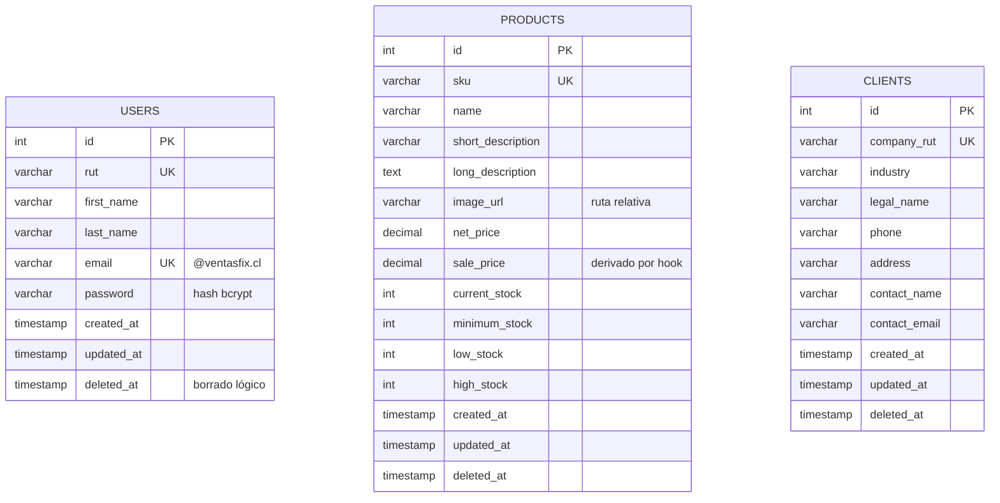

# Modelo de datos

Tres entidades independientes —`users`, `products` y `clients`— sin relaciones entre sí, porque el requerimiento no incluye pedidos ni carro de compra. Cada una lleva borrado lógico y marcas de tiempo.

## Convención de nomenclatura

**Todo el código en inglés**: tablas, columnas, campos de la API, identificadores y estructura de archivos.

| Ámbito | Idioma | Ejemplo |
|---|---|---|
| Tablas y columnas | Inglés | `products.net_price`, `clients.legal_name` |
| Campos de la API | Inglés | `{ "legal_name": "..." }` |
| Estructura y roles de archivo | Inglés | `controllers/`, `product.service.js` |
| Métodos y variables | Inglés | `findById`, `createProduct` |
| Documentación (`docs/`) | Español | Este documento |
| Comentarios en el código | Inglés | `// Anti-corruption layer: ...` |

### Única excepción: `rut`

`rut` se conserva sin traducir porque nombra un **instrumento legal chileno específico** —el Rol Único Tributario, con su formato y dígito verificador propios—, no un concepto genérico. Los acrónimos de instrumentos legales no se traducen: nadie escribe `international_bank_account_number` en lugar de `iban`.

Traducirlo a `tax_id` perdería precisión: un desarrollador que lee `tax_id` no sabe que el valor exige validación de dígito verificador.

### Correspondencia con el enunciado

El indicador de modelos exige *"todos los campos solicitados"*. Esta tabla permite verificar la cobertura campo por campo.

| Enunciado | Columna | Entidad |
|---|---|---|
| id | `id` | las tres |
| rut | `rut` | `users` |
| nombre | `first_name` | `users` |
| apellido | `last_name` | `users` |
| email | `email` | `users` |
| password | `password` | `users` |
| sku | `sku` | `products` |
| nombre | `name` | `products` |
| descripción corta | `short_description` | `products` |
| descripción larga | `long_description` | `products` |
| imagen del producto | `image_url` | `products` |
| precio neto | `net_price` | `products` |
| precio de venta | `sale_price` | `products` |
| stock actual | `current_stock` | `products` |
| stock mínimo | `minimum_stock` | `products` |
| stock bajo | `low_stock` | `products` |
| stock alto | `high_stock` | `products` |
| rut empresa | `company_rut` | `clients` |
| rubro | `industry` | `clients` |
| razón social | `legal_name` | `clients` |
| teléfono | `phone` | `clients` |
| dirección | `address` | `clients` |
| nombre de la persona de contacto | `contact_name` | `clients` |
| email de la persona de contacto | `contact_email` | `clients` |

**24 campos del enunciado, 24 columnas.** Ninguno falta, ninguno sobra.

## Diagrama



**No hay relaciones porque el requerimiento no las pide.** Inventar una tabla de pedidos para "que se vea más completo" agrega superficie de error sin sumar un punto.

## Tablas

### `users`

Trabajadores con acceso al backoffice.

| Columna | Tipo | Restricciones | Notas |
|---|---|---|---|
| `id` | `SERIAL` | PK | |
| `rut` | `VARCHAR(12)` | NOT NULL, UNIQUE | Validado con dígito verificador |
| `first_name` | `VARCHAR(100)` | NOT NULL | |
| `last_name` | `VARCHAR(100)` | NOT NULL | |
| `email` | `VARCHAR(150)` | NOT NULL, UNIQUE | Es el nombre de usuario. Debe terminar en `@ventasfix.cl` |
| `password` | `VARCHAR(60)` | NOT NULL | Hash bcrypt. **Nunca se devuelve por la API** |
| `deleted_at` | `TIMESTAMP` | NULL | Borrado lógico |

Reglas aplicadas:

- El hook `beforeSave` cifra la contraseña si cambió. No existe camino por el ORM que guarde texto plano.
- `defaultScope` excluye `password` de toda consulta. Para que se filtre haría falta pedirla explícitamente.
- El dominio `@ventasfix.cl` se valida en el schema Zod **y** en el modelo, porque la API no es la única puerta de escritura (también están los seeders).

### `products`

| Columna | Tipo | Restricciones | Notas |
|---|---|---|---|
| `id` | `SERIAL` | PK | |
| `sku` | `VARCHAR(50)` | NOT NULL, UNIQUE | Código interno |
| `name` | `VARCHAR(150)` | NOT NULL | |
| `short_description` | `VARCHAR(255)` | NOT NULL | Para listados |
| `long_description` | `TEXT` | NOT NULL | Para el detalle |
| `image_url` | `VARCHAR(255)` | NOT NULL | Ruta relativa al volumen. Una sola imagen por producto |
| `net_price` | `DECIMAL(12,2)` | NOT NULL, `>= 0` | Sin IVA |
| `sale_price` | `DECIMAL(12,2)` | NOT NULL, `>= 0` | `net_price × (1 + TAX_RATE)`. Lo recalcula el hook |
| `current_stock` | `INTEGER` | NOT NULL, `>= 0` | |
| `minimum_stock` | `INTEGER` | NOT NULL, `>= 0` | Ver umbrales |
| `low_stock` | `INTEGER` | NOT NULL | Ver umbrales |
| `high_stock` | `INTEGER` | NOT NULL | Ver umbrales |
| `deleted_at` | `TIMESTAMP` | NULL | Borrado lógico |

**`DECIMAL`, nunca `FLOAT`.** Los precios son dinero y el punto flotante binario no representa exactamente los decimales: `0.1 + 0.2` da `0.30000000000000004`. Acumulado en un catálogo, eso es un descuadre contable.

#### Umbrales de stock

El enunciado pide `stock mínimo`, `stock bajo` y `stock alto` sin definir qué significa cada uno. Interpretación adoptada:

| Columna | Significado | Uso en el sistema |
|---|---|---|
| `minimum_stock` | Punto de reposición. Bajo este nivel hay riesgo de quiebre | Alerta roja en el listado |
| `low_stock` | Umbral de advertencia temprana | Alerta amarilla |
| `high_stock` | Tope de almacenamiento; sobre este nivel hay sobrestock | Alerta azul |

Se impone la relación por restricción de base de datos, no solo por validación:

```sql
CHECK (minimum_stock <= low_stock AND low_stock <= high_stock)
```

La validación en Zod da un mensaje amable al usuario; el `CHECK` garantiza que ningún camino de escritura —ni un `INSERT` manual— pueda romper la regla.

### `clients`

Clientes empresa de VentasFix.

| Columna | Tipo | Restricciones | Notas |
|---|---|---|---|
| `id` | `SERIAL` | PK | |
| `company_rut` | `VARCHAR(12)` | NOT NULL, UNIQUE | Validado con dígito verificador |
| `industry` | `VARCHAR(100)` | NOT NULL | Rubro |
| `legal_name` | `VARCHAR(200)` | NOT NULL | Razón social |
| `phone` | `VARCHAR(20)` | NOT NULL | Formato chileno |
| `address` | `VARCHAR(255)` | NOT NULL | |
| `contact_name` | `VARCHAR(150)` | NOT NULL | Persona de contacto |
| `contact_email` | `VARCHAR(150)` | NOT NULL | Sin restricción de dominio: son externos |
| `deleted_at` | `TIMESTAMP` | NULL | Borrado lógico |

Los campos de contacto se aplanan con prefijo `contact_` en lugar de crear una tabla aparte: es una relación 1:1 obligatoria con dos campos, y normalizarla solo agregaría un `JOIN` a cada consulta.

## Decisiones transversales

### Borrado lógico en las tres tablas

Todos los modelos usan `paranoid: true`. `destroy()` escribe `deleted_at` en lugar de eliminar la fila, y todas las consultas filtran los registros borrados automáticamente. → [ADR-007](adr/ADR-007-borrado-logico.md)

Consecuencia directa: los conteos del dashboard quedan correctos sin escribir un solo `WHERE`.

### Índices

Los índices únicos son **parciales**: aplican solo a los registros vigentes.

| Índice | Tabla | Justificación |
|---|---|---|
| `UNIQUE (email) WHERE deleted_at IS NULL` | `users` | Credencial de login; se consulta en cada autenticación |
| `UNIQUE (rut) WHERE deleted_at IS NULL` | `users` | Identidad de negocio |
| `UNIQUE (sku) WHERE deleted_at IS NULL` | `products` | Identidad de negocio; se verifica antes de cada alta |
| `UNIQUE (company_rut) WHERE deleted_at IS NULL` | `clients` | Identidad de negocio |
| `(deleted_at)` | las tres | Toda consulta filtra por esta columna |

Un `UNIQUE` corriente seguiría aplicando a las filas borradas lógicamente, lo que impediría reutilizar el email de un usuario eliminado y devolvería un `500` en vez de un `409`. El porqué completo está en [ADR-007](adr/ADR-007-borrado-logico.md#el-choque-entre-unique-y-el-borrado-lógico).

### Migraciones, no `sync()`

El esquema se versiona con `sequelize-cli`. **No se usa `sequelize.sync({ force: true })`**, que borra y recrea las tablas en cada arranque.

Las migraciones permiten levantar la base desde cero en un comando —útil para grabar el video—, revisar el historial de cambios del esquema en el repositorio y revertir con `db:migrate:undo`.

Los `seeders` cargan el usuario administrador inicial y datos de prueba, así el evaluador puede iniciar sesión sin registrarse primero.

### Nombres de columna en snake_case

Los modelos se declaran con `underscored: true`, así que Sequelize traduce automáticamente entre el `camelCase` del código JavaScript y el `snake_case` de PostgreSQL.

Motivo: PostgreSQL pliega a minúsculas los identificadores sin comillas, de modo que `createdAt` se convierte en `createdat` y obliga a entrecomillar cada referencia en SQL manual. `snake_case` es la convención del motor.

## Siguiente paso

Leé [04-CONTRATO-API.md](04-CONTRATO-API.md) para ver cómo se exponen estas entidades.
