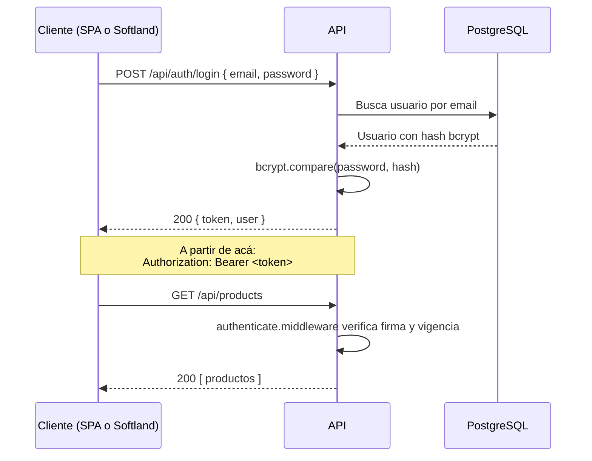

# Contrato de la API

API REST bajo `/api`, autenticada con JWT Bearer. Documentada en Swagger UI en **`/api-docs`**, generada desde los mismos schemas Zod que validan las peticiones — la documentación no puede desincronizarse de la validación.

## Autenticación en un vistazo



Todos los endpoints exigen `Authorization: Bearer <token>`, excepto `POST /api/auth/login`.

## Endpoints

### Autenticación

| Método | Ruta | Éxito | Errores posibles |
|---|---|---:|---|
| `POST` | `/api/auth/login` | `200` | `401` credenciales inválidas · `422` datos mal formados · `429` demasiados intentos |
| `GET` | `/api/auth/me` | `200` | `401` |

### Usuarios · Productos · Clientes

Los tres recursos comparten exactamente la misma forma. Se muestra `users`; `products` y `clients` son idénticos.

| Método | Ruta | Éxito | Errores posibles |
|---|---|---:|---|
| `GET` | `/api/users` | `200` | `401` |
| `GET` | `/api/users/:id` | `200` | `401` · `404` |
| `POST` | `/api/users` | `201` + `Location` | `401` · `409` duplicado · `422` validación |
| `PUT` | `/api/users/:id` | `200` | `401` · `404` · `409` · `422` |
| `DELETE` | `/api/users/:id` | `204` | `401` · `404` |

**Uniformidad deliberada.** Que los tres recursos se comporten igual permite que el front use los mismos componentes y hooks para los tres mantenedores, y que el evaluador aprenda el contrato una sola vez.

### Dashboard e integración

| Método | Ruta | Éxito | Errores posibles |
|---|---|---:|---|
| `GET` | `/api/dashboard/summary` | `200` | `401` |
| `POST` | `/api/softland/sync` | `200` | `401` · `502` si el ERP no responde |

`GET /api/dashboard/summary` devuelve los tres conteos en una sola petición:

```json
{ "users": 4, "products": 27, "clients": 12 }
```

Un endpoint agregado, no tres llamadas separadas: el dashboard es una sola vista conceptual y pedirlo en tres viajes multiplica la latencia sin ganar nada.

## Códigos de respuesta

La correspondencia entre errores de dominio y códigos HTTP vive en **un solo archivo**: `middlewares/errorHandler.middleware.js`.

| Clase de error | HTTP | Cuándo |
|---|---:|---|
| — (éxito en lectura o actualización) | `200` | La operación devolvió un recurso |
| — (éxito en creación) | `201` | Recurso creado. Incluye cabecera `Location` |
| — (éxito sin contenido) | `204` | Borrado exitoso. Sin cuerpo |
| `BadRequestError` | `400` | El cuerpo no se puede ni interpretar (JSON mal formado) |
| `ValidationError` | `422` | Los datos son sintácticamente válidos pero no cumplen las reglas |
| `UnauthorizedError` | `401` | Falta el token, está vencido o las credenciales son incorrectas |
| `ForbiddenError` | `403` | Autenticado, pero sin permiso para esa operación |
| `NotFoundError` | `404` | El recurso solicitado no existe |
| `ConflictError` | `409` | Choca con un recurso existente (email, RUT o SKU duplicado) |
| `PayloadTooLargeError` | `413` | La imagen supera `MAX_UPLOAD_SIZE` |
| `UnsupportedMediaTypeError` | `415` | El tipo MIME del archivo no está en la lista blanca |
| `ExternalServiceError` | `502` | Softland no respondió o devolvió un error |
| *(no controlado)* | `500` | Falla inesperada. Se registra completa, se responde genérica |

Los errores de librerías externas se traducen a clases de dominio **antes** de llegar a la tabla, para que no caigan en el caso no controlado:

| Error de origen | Se traduce a | HTTP |
|---|---|---|
| `express.json()` con `type: entity.parse.failed` (JSON mal formado) | `BadRequestError` | `400` |
| `express.json()` con `type: entity.too.large` | `PayloadTooLargeError` | `413` |
| `MulterError` con código `LIMIT_FILE_SIZE` | `PayloadTooLargeError` | `413` |
| `MulterError` por tipo MIME rechazado | `UnsupportedMediaTypeError` | `415` |
| `SequelizeUniqueConstraintError` | `ConflictError` | `409` |

La traducción de `SequelizeUniqueConstraintError` no es redundante con la verificación de unicidad del servicio: cubre la condición de carrera entre esa verificación y el `INSERT`. Ver [ADR-007](adr/ADR-007-borrado-logico.md#el-choque-entre-unique-y-el-borrado-lógico).

### Sobre `422` frente a `400`

Se usa `422 Unprocessable Entity` para fallos de validación porque el cuerpo **sí** es JSON bien formado; lo que falla son las reglas de negocio. `400 Bad Request` queda para peticiones que el servidor no puede ni interpretar. Ambos son defendibles y la mayoría de las APIs usan `400`; lo que importa para la evaluación es que el criterio sea **consistente en los quince endpoints**, y eso lo garantiza tenerlo en un solo archivo.

### Por qué `204` y no `200` al eliminar

`204 No Content` comunica exactamente lo ocurrido: la operación tuvo éxito y no hay nada que devolver. Un `200` con `{ "mensaje": "eliminado" }` obliga al cliente a leer un cuerpo que no aporta información.

Detalle relevante: aunque el borrado es **lógico**, la respuesta HTTP es la misma que la de un borrado físico. Desde afuera el recurso dejó de existir, y eso es lo único que el contrato promete.

## Formato de errores

Una sola forma para todos los errores de la API:

```json
{
  "error": {
    "type": "ValidationError",
    "message": "Los datos enviados no son válidos",
    "details": [
      { "field": "email", "message": "Debe pertenecer al dominio @ventasfix.cl" },
      { "field": "net_price", "message": "Debe ser un número mayor o igual a 0" }
    ]
  }
}
```

| Campo | Propósito |
|---|---|
| `type` | Permite al cliente reaccionar por clase de error sin parsear texto |
| `message` | Mensaje legible para mostrar al usuario |
| `details` | Solo en errores de validación. Permite marcar el campo exacto en el formulario |

Gracias a `details`, el formulario de React resalta el campo incorrecto sin que el front tenga que replicar las reglas de validación del backend.

## Verificación

- [ ] Los quince endpoints CRUD responden el código de la tabla
- [ ] `POST` devuelve `201` con cabecera `Location`, no `200`
- [ ] `DELETE` devuelve `204` sin cuerpo
- [ ] Un `id` inexistente devuelve `404`, nunca `500`
- [ ] Un email o SKU duplicado devuelve `409`, no `422`
- [ ] Sin token, todos los endpoints protegidos devuelven `401`
- [ ] Swagger UI en `/api-docs` refleja estos mismos contratos
- [ ] `password` no aparece en ninguna respuesta de la API

## Siguiente paso

Leé [05-TRAZABILIDAD-RUBRICA.md](05-TRAZABILIDAD-RUBRICA.md) para verificar cobertura de la evaluación.
