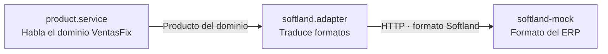

# ADR-006 — Mock de Softland como contenedor + patrón Adapter

| | |
|---|---|
| **Estado** | Aceptada |
| **Fecha** | 2026-09-14 |
| **Indicadores** | Componentes reutilizables (5) · Patrones de diseño (7) |

## Contexto

El indicador dice: *"componentes reutilizables **con consumo de servicio externo**"* (5 pts), y el nivel inferior (4 pts) cae por *"no realizan el consumo del servicio externo"*.

**"Servicio externo" no está definido en ningún lado.** Admite dos lecturas: la propia API REST —que desde el navegador es externa— o un tercero real. Apostar a una lectura y equivocarse cuesta un punto sin posibilidad de defensa posterior.

La forma de no depender de la interpretación es hacer que la respuesta sea inequívoca. Y el enunciado da la narrativa: *"tienen contratado un sistema de gestión con Softland"*.

## Decisión

Un servicio **`softland-mock`** como contenedor independiente en el Docker Compose, con su propia URL en variables de entorno.

- El backend lo consume a través de un **Adapter**: `api/src/services/softland.adapter.js`.
- El front tiene un componente reutilizable `SoftlandSyncPanel` que dispara y muestra la sincronización.

Al ser otro proceso, en otro host, detrás de una frontera HTTP real, es externo sin ambigüedad.

## Alternativas consideradas

### API pública real (mindicador.cl)

Consumir los indicadores del Banco Central y mostrar precios convertidos a UF.

| A favor | En contra |
|---|---|
| Innegablemente externo: dominio de terceros, visible en la pestaña Network | No tiene relación con Softland ni con la narrativa del caso |
| Gratis, sin credenciales | Depende de que el servicio esté disponible al grabar |
| Pertinente al contexto chileno | No habilita explicar ningún patrón |

**Descartada** por ser ajena al caso. Sigue disponible como refuerzo de bajo costo si se quiere.

### Solo la propia API REST

Componentes genéricos que consumen el backend propio.

| A favor | En contra |
|---|---|
| Es trabajo que se hace igual | Apuesta a que el evaluador lea "externo" como "fuera del *bundle* de React" |
| Cero riesgo de indisponibilidad | Si lo lee como "de terceros", se queda en 4 puntos sin defensa |

**Descartada como única estrategia.** Los componentes genéricos se construyen igual: no compiten con esta decisión, la complementan.

## Por qué un Adapter y no llamadas directas

Un ERP de terceros impone su propio formato de datos. Si `axios.get(SOFTLAND_URL)` se llamara desde los controllers, el formato de Softland se filtraría por todo el sistema, y el día que cambie una versión de su API habría que tocar diez archivos.

El Adapter aísla ese contacto: **traduce el formato de Softland al del dominio de VentasFix** y nada más allá de ese archivo sabe cómo son los datos del ERP. Es una *capa anticorrupción*: el modelo del tercero no contamina el propio.

## Consecuencias

### Se gana

- **Reconocible sin explicación**: es la narrativa literal del enunciado.
- **Externo de forma demostrable**: otro contenedor, otra URL, request visible en la pestaña Network.
- **Habilita explicar un patrón real** —Adapter / capa anticorrupción—, munición directa para los 7 puntos de patrones de diseño.
- **Doble cobertura del indicador**: componentes genéricos reutilizables *y* consumo externo.

### Se paga

- **Un contenedor y un adapter más** que construir y mantener.
- **Objeción posible**: un evaluador estricto podría alegar que un mock propio no es "de terceros". Se responde mostrando que corre como servicio separado, con su propia URL configurable — y que apuntar a un Softland real sería cambiar una variable de entorno.
- **Un modo de falla más**: si el mock no responde, la API devuelve `502`. Está contemplado en el contrato.

## Componentes reutilizables asociados

| Componente | Reutilizado en |
|---|---|
| `CrudTable` | Usuarios, productos y clientes |
| `EntityForm` | Todos los formularios de alta y edición |
| `PageHeader` | Dashboard y los 3 mantenedores |
| `ConfirmDelete` | Las tres operaciones de borrado |
| `StatCard` | Las 3 tarjetas del dashboard |
| `SoftlandSyncPanel` | Productos y dashboard |

## Evidencia

| Qué | Dónde |
|---|---|
| Servicio externo | `softland-mock` en `docker-compose.yml` |
| Adapter | `api/src/services/softland.adapter.js` |
| Endpoint de sincronización | `POST /api/softland/sync` |
| Componente que lo consume | `web/src/components/softland/SoftlandSyncPanel.jsx` |
| Configuración | `SOFTLAND_BASE_URL` y `SOFTLAND_API_KEY` en `.env.example` |
