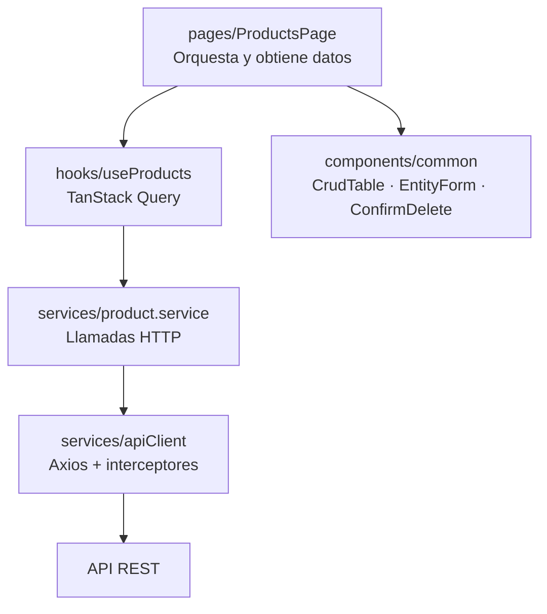

# ADR-011 — TanStack Query para el estado de servidor

| | |
|---|---|
| **Estado** | Aceptada |
| **Fecha** | 2026-09-14 |
| **Indicadores** | Componentes reutilizables (5) · Vistas (5) |

## Contexto

El front tiene cinco vistas, y tres de ellas —usuarios, productos y clientes— son estructuralmente idénticas: listar, ver, crear, editar y eliminar.

Hay un error conceptual que define esta decisión:

> **El estado del servidor no es estado de la aplicación.**

La lista de productos no le pertenece al front: vive en PostgreSQL, cualquiera puede modificarla, y la copia en `useState` queda desactualizada desde el primer milisegundo. Tratarla como estado local obliga a escribir `loading`, `error`, `data` y un `refetch()` manual después de cada creación, edición y borrado. Por cada mantenedor. Tres veces.

## Decisión

- **React Router** para las cinco vistas, con `ProtectedRoute` para las privadas.
- **TanStack Query** para todo el estado de servidor: caché, `loading`, `error`, reintentos e invalidación tras cada mutación.
- **Axios** con dos interceptores: uno inyecta el JWT, otro cierra sesión ante un `401`.
- Un *custom hook* por entidad: `useUsers`, `useProducts`, `useClients`.

## Alternativas consideradas

### `fetch` o Axios dentro de `useEffect` + `useState`

| A favor | En contra |
|---|---|
| Sin dependencias ni conceptos nuevos; React puro | El trío `loading`/`error`/`data` duplicado en tres mantenedores y el dashboard |
| Se ve exactamente cuándo se dispara cada petición | Olvidar un `refetch()` tras un borrado deja en pantalla un registro inexistente — **y eso pasa en vivo durante la grabación** |
| | Sin caché: cada navegación vuelve a pedir al servidor |
| | Condiciones de carrera clásicas al navegar rápido |

**Descartada.** El costo aparece justo donde más se nota: en la demostración.

### Redux Toolkit + RTK Query

| A favor | En contra |
|---|---|
| RTK Query hace el mismo trabajo de caché e invalidación | **Redux para estado de servidor es el sobredimensionamiento clásico**: un store global para datos que no son globales |
| DevTools con viaje en el tiempo | Más código repetitivo: slices, providers, configuración |
| Listo si mañana hace falta estado global de cliente | Con tres entidades y sin estado compartido real, no resuelve nada que TanStack no resuelva con menos |

**Descartada** por complejidad sin beneficio a esta escala.

## Consecuencias

### Se gana

- **La tabla se refresca sola.** `invalidateQueries` tras cada mutación: sin `refetch` manual y sin listas desactualizadas en cámara.
- **`loading` y `error` dejan de escribirse a mano**, así que los tres mantenedores quedan prácticamente idénticos — y eso **es** la reutilización que premia la rúbrica.
- **El JWT se centraliza en un interceptor**, no en quince llamadas.
- **El `401` cierra sesión automáticamente** desde un solo lugar.
- **El dashboard cachea los conteos** sin lógica adicional.

### Se paga

- **Una librería más** que aprender y justificar.
- **Conceptos nuevos**: `queryKey`, `staleTime`, invalidación. Una tarde si no se conoce.
- **Comportamiento por omisión sorprendente**: refetch al volver el foco a la ventana. Se configura explícitamente.

## Estructura del front

Es el patrón **Container / Presentational**: las páginas orquestan y obtienen datos; los componentes de `common/` solo reciben props y presentan, sin saber de dónde vienen los datos. Por eso el mismo `CrudTable` sirve para usuarios, productos y clientes.

## Componentes reutilizables

| Componente | Responsabilidad | Usado en |
|---|---|---|
| `CrudTable` | Tabla con orden, paginación y estados de carga, vacío y error | 3 mantenedores |
| `EntityForm` | Formulario que mapea el `details` del `422` al campo que falló | Todos los formularios |
| `PageHeader` | Título y acción primaria | Dashboard y los 3 mantenedores (el login no comparte la cáscara) |
| `ConfirmDelete` | Confirmación de acción destructiva | 3 borrados |
| `StatCard` | Conteo del dashboard con estado de carga | 3 tarjetas |
| `StockGauge` | Estado y barra de stock a partir de los tres umbrales | `ProductsPage` y el panel "Needs attention" del dashboard |

### `useProducts` en el dashboard

El dashboard ya no consume solo `useDashboard`. La tarjeta "Inventory value" y el panel "Needs attention" reutilizan `useProducts` —el mismo hook y la misma query de `ProductsPage`, sin un nuevo llamado HTTP— para derivar el valor de inventario y priorizar los productos que necesitan atención. Por eso el dashboard tiene dos estados de carga independientes: uno para los tres conteos (`useDashboard`) y otro propio para la tarjeta de inventario (`useProducts`).

## Evidencia

| Qué | Dónde |
|---|---|
| Rutas y protección | `web/src/routes/AppRouter.jsx`, `ProtectedRoute.jsx` |
| Hooks de datos | `web/src/hooks/` |
| Capa de servicios del front | `web/src/services/` |
| Interceptores | `web/src/services/apiClient.js` |
| Componentes reutilizables | `web/src/components/common/` |
